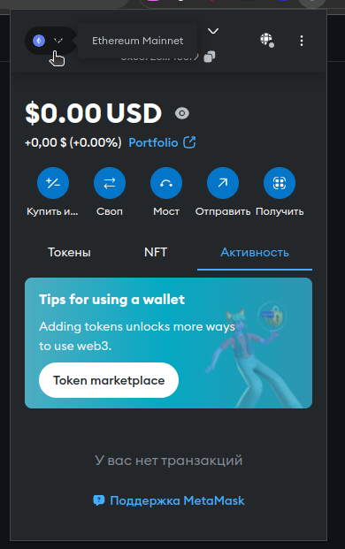
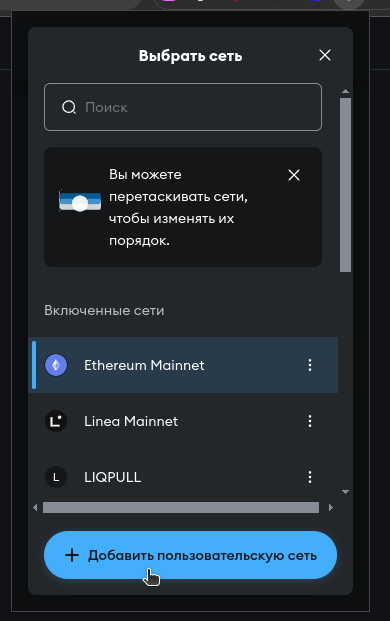
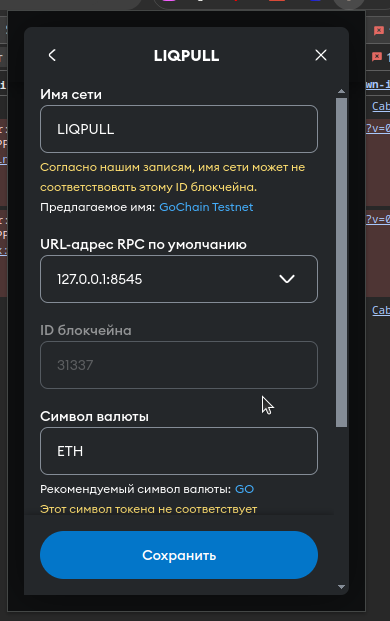
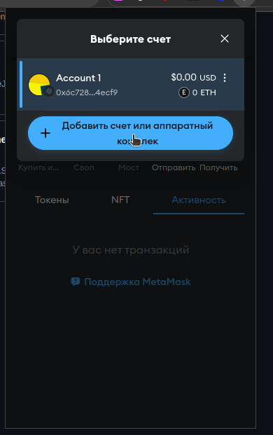
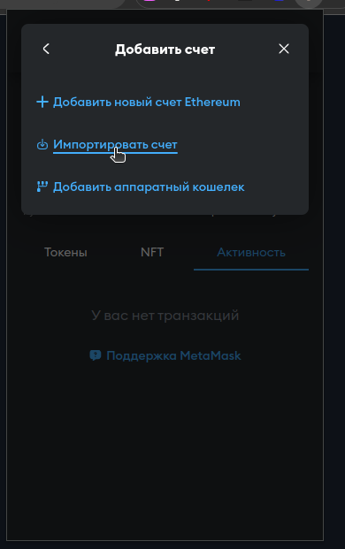
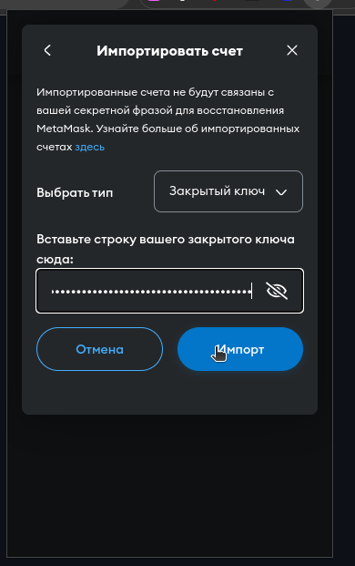
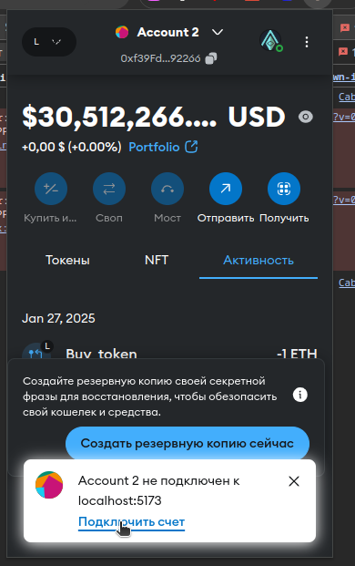

# Liquidity Pool

Liquidity Pool - это проект, разработанный для управления ликвидностью в децентрализованных финансовых приложениях. Он позволяет пользователям взаимодействовать с пулом ликвидности и эффективно управлять своими активами.

---

## 📋 Требования

Перед началом убедитесь, что у вас установлены следующие инструменты:

- [Node.js](https://nodejs.org/) (версии 14.x и выше)
- [npm](https://www.npmjs.com/) (в комплекте с Node.js)
- [Hardhat](https://hardhat.org/) (можно установить через npm)

---

## 🚀 Запуск проекта

Чтобы запустить проект, выполните условия и активируйте файл startX.sh в корневой директории проекта. Если по каким-то причинам файл startX.sh не работает, рекомендую вам воспользоваться ручным запуском:

### 🔧 Ручной запуск проекта

1. Перейдите в корневую директорию проекта и выполните следующие команды:

   cd backend/
   npm install
   npx hardhat clean
   npx hardhat node

2. Откройте новый терминал и выполните следующие команды:

   cd backend/
   npx hardhat run --network localhost deploy.js
   cd ../frontend
   npm install
   npm run dev

---

## 📖 Мануал для пользователя

Для того чтобы система работала стабильно, необходимо использовать кошелек Metamask. Выполните надстройку своего кошелька Metamask перед тем, как использовать систему:

1. Создайте собственную сеть в Metamask для взаимодействия с тестовой средой. Заполните данные сети и нажмите кнопку сохранить 
 

2. Импортируйте существующие аккаунты, используя приватный ключ. 

3. Не забудьте подключить каждый аккаунт Metamask к созданной в пункте 1 сети. 

### 🗂️ Аккаунты сети Ethereum

| Имя | Адрес | ключ|
| --- | --- | ---|
|tom|0xf39Fd6e51aad88F6F4ce6aB8827279cffFb92266|0xac0974bec39a17e36ba4a6b4d238ff944bacb478cbed5efcae784d7bf4f2ff80|
|ben|0x70997970C51812dc3A010C7d01b50e0d17dc79C8|0x59c6995e998f97a5a0044966f0945389dc9e86dae88c7a8412f4603b6b78690d|
|rick|0x3C44CdDdB6a900fa2b585dd299e03d12FA4293BC|0x5de4111afa1a4b94908f83103eb1f1706367c2e68ca870fc3fb9a804cdab365a|
|owner|0x90F79bf6EB2c4f870365E785982E1f101E93b906|0x7c852118294e51e653712a81e05800f419141751be58f605c371e15141b007a6|

---

Теперь вы готовы начать работу с проектом Liquidity Pool! Удачи! 🚀
### Аккаунты сети Ethereum

